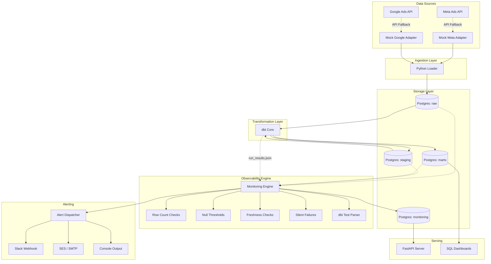

# Ad Pipeline Monitor — Architecture

This document describes the high-level architecture of the ELT Observability Platform.

## System Overview

The system is designed to ingest data from advertising platforms (Meta Ads, Google Ads), store it in a data warehouse (PostgreSQL), transform it using dbt, and monitor the pipeline for data quality issues and anomalies using a custom Python observability engine.

## Core Components

### 1. Ingestion Adapters (`ingestion/`)
- Abstract base class `AdPlatformAdapter` defines the interface (`fetch_campaigns`, `fetch_adsets`, `fetch_keywords`).
- **Real Adapters**: Connect directly to Graph API (Meta) and REST API via GAQL (Google).
- **Mock Adapters**: Fallback when credentials are not available. They generate highly realistic sample data and intentionally inject anomalies (spikes, drops, nulls) so the monitoring engine has something to catch.
- **Loader**: Upserts raw payloads into `raw` schema tables, serializing nested JSON arrays/objects into `JSONB` columns.

### 2. Data Warehouse (PostgreSQL)
- **Raw Layer**: Unmodified data as fetched from the APIs.
- **Staging Layer**: dbt views that clean, cast, and standardize fields across platforms.
- **Mart Layer**: Unified dimensional models (e.g., `fct_ad_performance`, `dim_campaign`) ready for BI tools.
- **Monitoring Layer**: Stores pipeline execution history, check results, and alert history.

### 3. Transformation & Testing (dbt)
- Transforms data using SQL models.
- Tests data quality natively (uniqueness, not_null, relationship, accepted_values).
- Custom macros define logic for row counts and freshness.

### 4. Observability Engine (`monitoring/`)
- The heart of the platform. Evaluates data across 5 dimensions:
  1. **Row Count Drift**: Computes Z-scores against a 7-day rolling average to detect sudden drops or spikes in ingestion volume.
  2. **Null Thresholds**: Monitors critical columns (e.g., `spend`, `cost`) to ensure null ratios don't exceed allowed limits.
  3. **Freshness SLAs**: Checks if tables are updating within expected timeframes (e.g., 6 hours).
  4. **Silent Failures**: Catches sneaky bugs like jobs that succeed but process 0 rows, missing date partitions, or staging models that update while downstream marts do not.
  5. **dbt Artifacts**: Parses `run_results.json` to treat dbt test failures as first-class observability incidents.

### 5. Alert Dispatcher
- Routes incidents to Slack and Email.
- Adapts to missing credentials by gracefully falling back to a Rich-formatted console output.

### 6. Monitoring API (FastAPI)
- Exposes pipeline health and anomaly history via REST endpoints.
- Allows external tools (like a Grafana dashboard) to query the monitoring state.

## Deployment Topologies

### Local Development (Docker Compose)
A fully isolated local environment:
- Container 1: PostgreSQL 15
- Container 2: App (Scheduler + Ingestion + Monitoring)
- Container 3: FastAPI server
- Container 4: dbt (Data transformations)

### Cloud Production (AWS Serverless)
- Compute: AWS Lambda handles ingestion, monitoring, and alerting via EventBridge cron triggers.
- Storage: Amazon RDS PostgreSQL instances.
- Networking: Deployed within a VPC.
- Alerting: Amazon SES for email dispatch.
